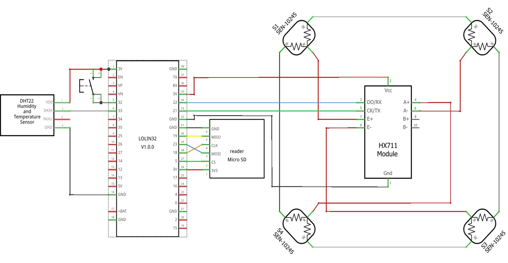
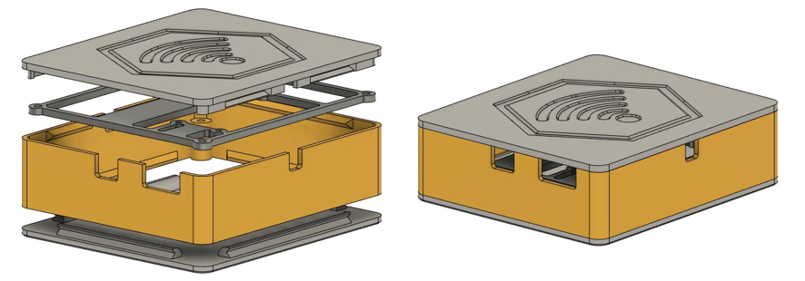
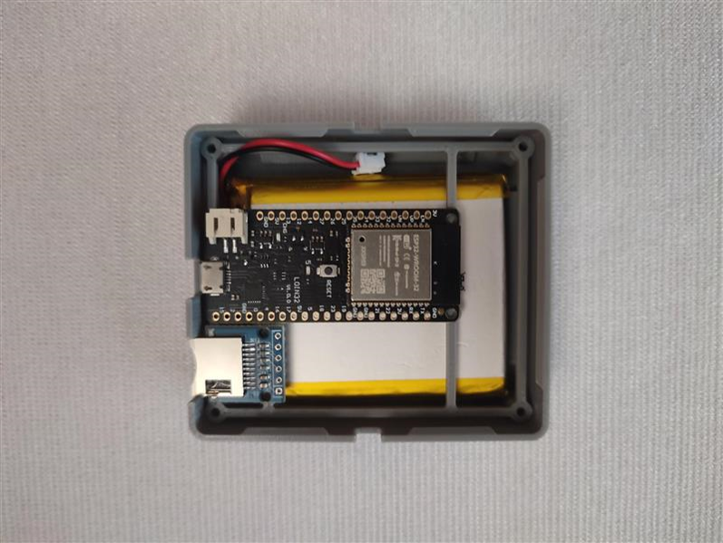
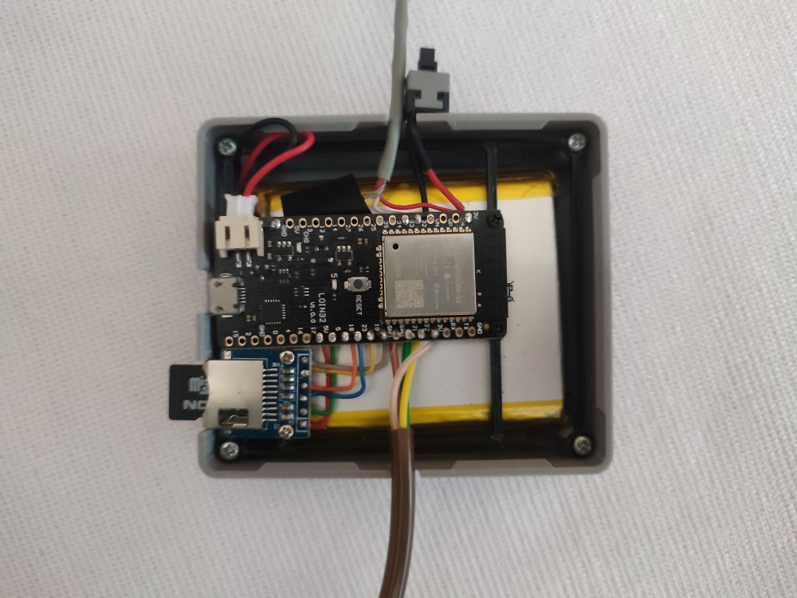
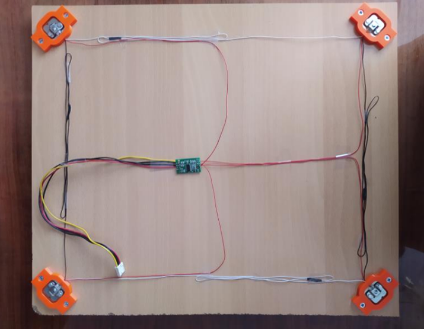
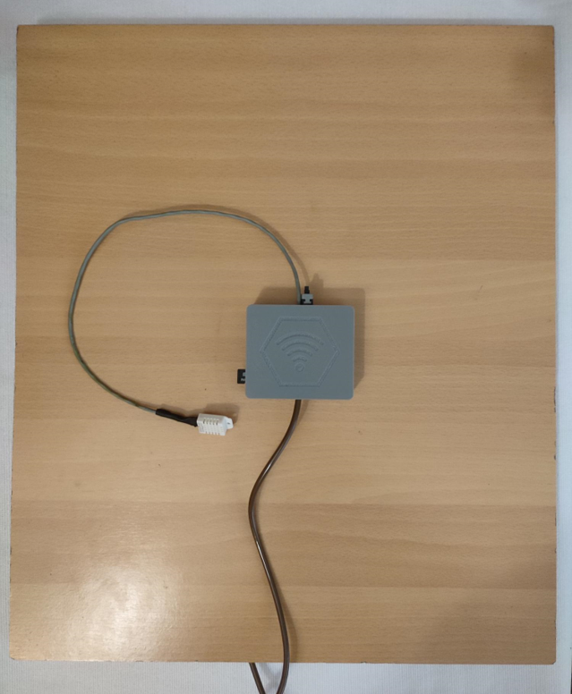

# Beehive Monitor


An ESP32-based IoT device for monitoring bee colony weight, in-hive temperature, and relative humidity with Bluetooth-based configuration. Data is logged locally to an SD card and uploaded wirelessly to a cloud database for remote viewing.

## Features

- **Weight monitoring**: four load cells (up to 200 kg combined) read via an HX711 amplifier/ADC
- **Temperature & humidity**: DHT22 sensor placed inside the hive
- **Wireless data upload**: sends readings to [ThingSpeak](https://thingspeak.com/) over WiFi
- **Local backup**: every reading is also appended to a CSV file on a microSD card
- **Email alerts**: automatic notifications when temperature, humidity, or weight moves outside normal bounds or changes abruptly
- **Bluetooth configuration**: set WiFi credentials, email recipient, scan interval, and scale calibration without reflashing the device
- **Low power**: the ESP32 spends most of its time in deep sleep, only waking to sample and transmit data

## Hardware

| Component                   | Part                       |
| --------------------------- | -------------------------- |
| Microcontroller             | WeMos LOLIN32 (ESP32)      |
| Temperature/humidity sensor | DHT22 (AM2302)             |
| Load cells                  | SEN-10245 (x4, 50 kg each) |
| ADC/amplifier               | HX711                      |
| Storage                     | microSD card module (SPI)  |
| Power                       | 5000 mAh Li-Po battery     |

## Wiring

| ESP32 Development board | Peripheral          |
| ----------------------- | ------------------- |
| GPIO 21                 | HX711 SCK           |
| GPIO 22                 | HX711 DT            |
| GPIO 33                 | DHT22 DATA          |
| GPIO 5                  | SD card CS          |
| GPIO 18                 | SD card CLK         |
| GPIO 19                 | SD card MISO        |
| GPIO 23                 | SD card MOSI        |
| GPIO 34                 | Reset/config button |

The four load cells are wired together into a Wheatstone bridge configuration and connected to the HX711 module.



## 3D Printed Parts

Two custom-printed parts are used in the build:

- **Load cell mounts**: each of the four load cells sits in a printed bracket that holds it slightly off the base plate, leaving room for the cell's center to flex under load. The bracket design used is a free model available on Thingiverse: [Fixed 50kg Loadcell](https://www.thingiverse.com/thing:4740463). Print four copies.
- **Enclosure**: a snap-fit case that holds the battery, the development board, and the microSD module on a mounting plate above it. The lid and bottom clip onto the middle section without screws, and the sides have cutouts for the USB port, the microSD slot, and the sensor/HX711 cabling. The 3D model files are included in `3D models/`.



## Assembly

1. Cut a wooden base plate sized to fit under the hive.
2. Mount each load cell to the underside of the base plate using a printed holder (see [3D Printed Parts](#3d-printed-parts)) at each corner, rather than screwing it directly to the wood - the holder provides mounting points and leaves the small clearance the load cell needs to flex under load.
3. Wire the four load cells together into a Wheatstone bridge (matching wire colors paired up, red wires left free) and connect the bridge's free leads to the HX711 module, then wire the HX711 and DHT22 to the board as described [above](#wiring).
4. Assemble the enclosure: fit the board and microSD module onto the mounting plate, place the battery underneath, and snap the lid and bottom onto the middle section.
<table>
  <tr>
    <td></td>
    <td></td>
  </tr>
  <tr>
    <td></td>
    <td></td>
</table>

## Repository Structure

```
beehive_monitor.ino     # main sketch (setup/loop, deep sleep control)
BeehiveMonitor.h        # core class tying sensors, WiFi, DB, SD, and email together
Wifi.h                  # WiFi connection management
Database.h              # ThingSpeak upload wrapper
SDCardController.h      # SD card read/write helpers
EmailAlert.h            # SMTP alert emails with HTML formatting
Config.h                # pin assignments and thresholds
```

## Configuration

The repo includes a `Config.h` with placeholder values. Before flashing, replace the placeholders (especially `SENDER_EMAIL_LOGIN` and `SENDER_EMAIL_PASSWORD`) with your own:

```cpp
#pragma once
#define DHT_PIN 33
#define MIN_TEMPERATURE 32
#define MAX_TEMPERATURE 36
#define ALLOWED_TEMP_CHANGE 10
#define MIN_HUMIDITY 50
#define MAX_HUMIDITY 95
#define ALLOWED_HUM_CHANGE 25
#define HX711_DATA_PIN 22
#define HX711_CLOCK_PIN 21
#define DEFAULT_SCALE_OFFSET 300000
#define DEFAULT_SCALE_CALIBRATION 115
#define ALLOWED_WEIGHT_CHANGE 2
#define THINGSPEAK_CHANNEL_ID 0000000
#define THINGSPEAK_WRITE_API_KEY "your-thingspeak-write-api-key"
#define SENDER_EMAIL_NAME "Beehive Monitor"
#define SENDER_EMAIL_LOGIN "your-email@example.com"
#define SENDER_EMAIL_PASSWORD "your-app-password"
#define SCAN_DELAY 30
#define TIMEZONE 1
#define DAYSAVETIME 1
```

`THINGSPEAK_CHANNEL_ID` and `THINGSPEAK_WRITE_API_KEY` are passed into the `BeehiveMonitor` constructor in the main sketch — create your own channel at [ThingSpeak](https://thingspeak.com/) and use its ID and write key here.

## Dependencies (Arduino libraries)

- [DHT sensor library](https://github.com/adafruit/DHT-sensor-library) (Adafruit)
- [HX711](https://github.com/RobTillaart/HX711) (Rob Tillaart)
- [ThingSpeak Arduino library](https://github.com/mathworks/thingspeak-arduino)
- [EMailSender](https://github.com/xreef/EMailSender)

## First-time Setup

On first boot (or after a factory reset), the device enters a 2-minute Bluetooth configuration window. Connect using any serial Bluetooth terminal app and send the following commands:

| Command                  | Description                                      |
| ------------------------ | ------------------------------------------------ |
| `wifi <ssid> <password>` | Set WiFi credentials                             |
| `email <address>`        | Set alert recipient email                        |
| `id <number>`            | Set hive ID (for multi-hive ThingSpeak channels) |
| `delay <minutes>`        | Set measurement interval (minimum 15)            |
| `tare`                   | Zero the scale                                   |
| `calibrate <grams>`      | Calibrate using a known reference weight         |
| `offset <value>`         | Manually set scale offset                        |
| `scale <factor>`         | Manually set scale calibration factor            |
| `clear`                  | Wipe all stored settings                         |
| `ready`                  | Finish setup and start normal operation          |

Once WiFi and email are set, sending `ready` exits configuration mode and the device begins its normal sense → upload → save → sleep cycle.

## How It Works

1. On wake, the device loads saved settings from flash (WiFi credentials, calibration, last readings).
2. It reads temperature, humidity, and weight.
3. Readings are compared against configured thresholds and against the previous reading; out-of-range or sharply changed values trigger an email alert.
4. Data is uploaded to ThingSpeak (if WiFi is available) and appended to `data.csv` on the SD card with a timestamp synced via NTP.
5. WiFi is turned off and the device goes into deep sleep until the next scheduled reading.
